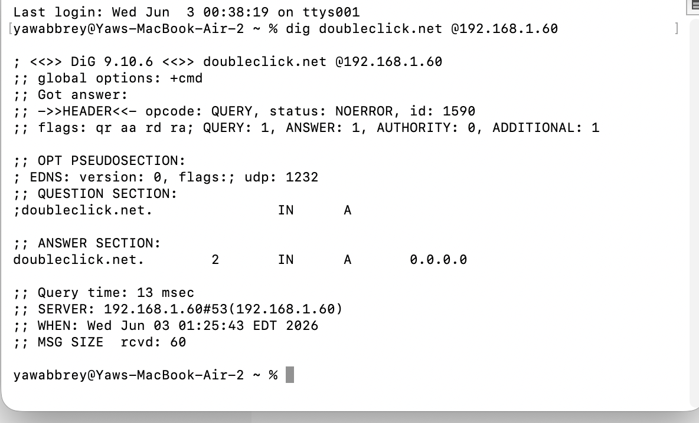

# 🛡️ Pi-hole Network Ad Blocker — Proxmox LXC Deployment

## Overview
Deployed a network-wide DNS ad-blocking solution using **Pi-hole v6** 
inside a lightweight **LXC container** on a Proxmox homelab server.

This project involved real-world troubleshooting across multiple layers 
of the network stack — from DNS misconfiguration to IP conflicts and 
vendor-locked router limitations.

## Architecture

## Tech Stack
| Component | Details |
|---|---|
| **Hypervisor** | Proxmox VE |
| **Container** | LXC (Debian 12) |
| **DNS Service** | Pi-hole v6.4.2 |
| **Upstream DNS** | Cloudflare (1.1.1.1) with DNSSEC |
| **Blocklist** | StevenBlack Hosts (84,752 domains) |
| **Hardware** | AT&T BGW530-900 (5G Gateway) |

## Results
- ✅ 84,752 ad/tracking domains blocked network-wide
- ✅ DNS queries resolved in ~4ms
- ✅ Zero per-device configuration required
- ✅ Lightweight — LXC uses ~100MB RAM vs 512MB+ for a full VM

## Skills Demonstrated
- Linux container management (LXC vs VM decision-making)
- DNS infrastructure & network routing
- Static IP planning & DHCP management
- Linux server administration (Debian 12)
- Network troubleshooting methodology
- Pi-hole v6 configuration & SQLite database management

## Project Docs
- [LXC Setup](docs/lxc-setup.md)
- [Pi-hole Installation](docs/pihole-install.md)
- [DNS Configuration](docs/dns-config.md)
- [Troubleshooting Log](docs/troubleshooting.md)
- [Network Map](docs/network-map.md)

## Key Troubleshooting Challenges
| Problem | Root Cause | Solution |
|---|---|---|
| DNS not resolving in LXC | Empty resolv.conf | Set nameservers at Proxmox host level |
| resolv.conf overridden | Proxmox controls container DNS | Edited `/etc/pve/lxc/101.conf` |
| search domain conflict | `google.com` appended to lookups | Changed searchdomain to `local` |
| IP conflict PVE vs LXC | Same IP assigned to both | Reassigned LXC to 192.168.1.60 |
| Pi-hole v6 gravity timeout | Upstream DNS not set in pihole.toml | Added upstreams to TOML config |
| Blocklist download failing | FTL DNS loop during gravity | Direct SQLite import workaround |
| AT&T router blocking DNS | BGW530 doesn't expose DNS settings | Set DNS manually per device |

## Screenshots
### Pi-hole Dashboard

### Blocking Confirmed — doubleclick.net returns 0.0.0.0

## What I Learned
- How DNS resolution works at a system level
- Difference between LXC containers and full VMs
- How DHCP and DNS interact on a home network
- Real-world impact of vendor-locked ISP equipment
- Pi-hole v6 TOML configuration format
- SQLite database management in Linux
- Professional network troubleshooting methodology

## Future Improvements
- [ ] Add Unbound recursive DNS resolver
- [ ] Set up WireGuard VPN for Pi-hole on mobile
- [ ] Deploy third-party router for full network DNS control
- [ ] Add Grafana dashboard for DNS analytics
- [ ] Automate blocklist updates with cron job
